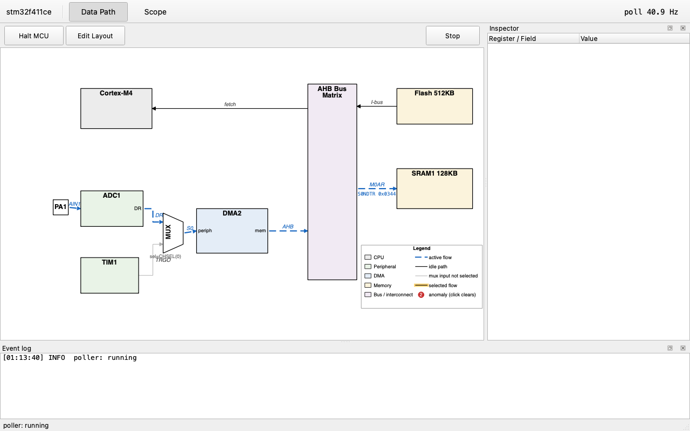
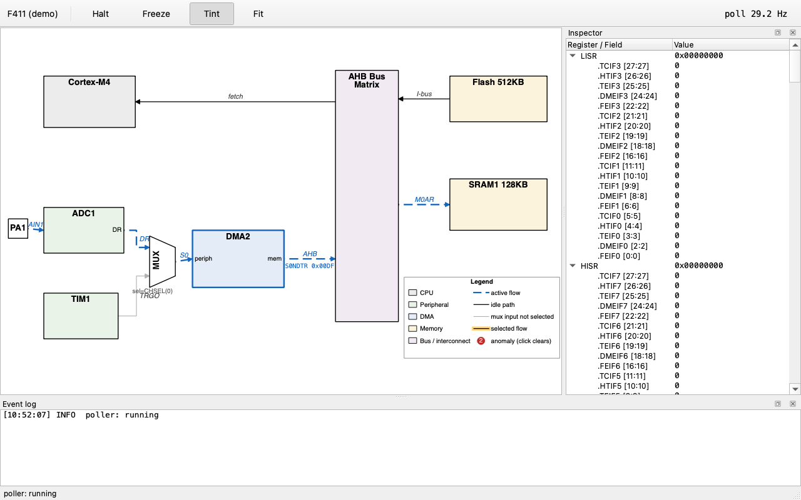
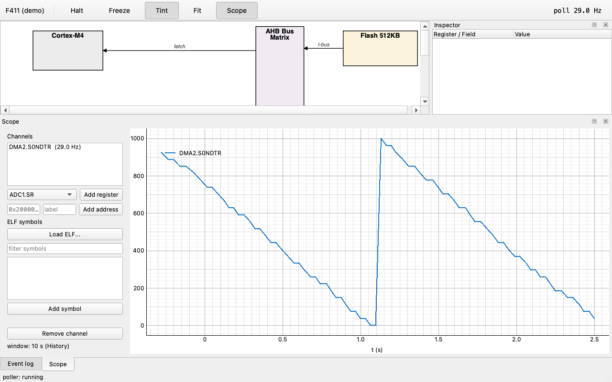
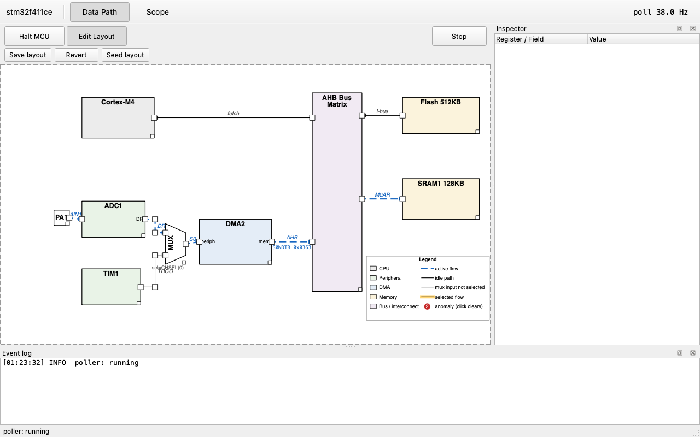

# PathScope

PathScope is a desktop tool that shows an MCU's internal data paths as a
live block diagram - which paths data is flowing through, how the
registers behind them evolve, and where declarative rules catch anomalies
such as an overrun flag or a stalled DMA channel. It reads registers over
a debug probe (SWD via pyOCD) at tens of Hz, so bring-up and debugging
sessions get a live picture of what a peripheral chain is actually doing
instead of scattered register dumps. New targets are added with plain
description files - no changes to the core engine or UI.

All four screenshots come from a live session against an STM32F411
Blackpill over a clone ST-Link.

## Features

- Live block diagram of a data path, with active edges animated and
  annotated with a real progress value (e.g. a DMA byte count).
- Declarative rules (YAML) turn register conditions into anomaly badges
  and event-log entries.
- Guarded-register safety: registers with a read side effect (SVD
  `readAction`, or a `guarded` entry in flows.yaml for vendor SVDs that
  don't annotate it) are never swept by the poller; reading one requires
  an explicit, per-click confirmation.
- Register inspector dock with live values for polled registers and
  on-demand reads for everything else.
- Memory viewer for on-demand hex dumps of memory blocks, with the same
  guarded-range protection as the register inspector.
- Scope view: a firmware trace-buffer sampler captures registers, fixed
  addresses, or ELF symbols in one timer-ISR call, so every record in a
  sample is coherent by construction; the tool drains the ring over the
  debug probe, decodes it, and plots it with event markers and
  gap-honest line breaks where sampling actually stalled. Ten fixed
  channel slots with per-channel type decode (u8/i16/f32/...), scale
  and offset, an Auto-lane stacking mode, and a hover cursor readout.
- Layout edit mode: drag blocks, wire endpoints and waypoints directly
  on the diagram instead of hand-editing coordinates - grid snap,
  arrow-key nudge, alignment guides, endpoints that snap back onto
  their block, wires that follow a moving block live, undo, and a
  Seed layout button for a first draft when a target has no positions
  yet. Saving patches topology.yaml surgically (see "Adding your own
  target" below).
- Demo mode (`--demo`) runs the full UI against a scripted engine, no
  probe or target required.

## Quick start

Every dependency - PySide6 included - installs from this repo's
`pyproject.toml`; nothing needs a separate install step. Python 3.9+.

With [uv](https://docs.astral.sh/uv/) (fast, same commands on every
OS):

    uv venv
    uv pip install -e ".[ui,dev]"

Or with the standard venv + pip - macOS / Linux:

    python3 -m venv .venv
    .venv/bin/pip install -e ".[ui,dev]"

Windows (PowerShell):

    py -m venv .venv
    .venv\Scripts\pip install -e ".[ui,dev]"

What gets installed:

- always: `pyocd` (SWD probe access), `PyYAML` (target files)
- `[ui]` extra: `PySide6` (Qt widgets), `pyqtgraph` (scope plotting),
  `pyelftools` (ELF symbol lookup)
- `[dev]` extra: `pytest`, `pytest-qt`

A headless CLI-only install (probe/monitor, no GUI) is plain
`pip install -e .`. On Linux, PySide6 additionally needs the Qt
xcb/EGL system libraries - the Debian/Ubuntu package list lives in
`.github/workflows/ci.yml`. The commands below use the macOS/Linux
`.venv/bin/` prefix; on Windows substitute `.venv\Scripts\`.

No hardware needed:

    .venv/bin/pathscope gui --demo

With a Blackpill (STM32F411CE) + ST-Link:

    .venv/bin/pyocd pack install stm32f411ce   # one-time, see Probe notes
    .venv/bin/pathscope gui
    .venv/bin/pathscope probe                  # print target identity
    .venv/bin/pathscope monitor --seconds 15   # headless poll-rate check

The scope view needs a firmware-side trace buffer: link
`firmware/ps_trace` into the firmware and call `ps_trace_sample()`
from one periodic timer ISR (1 kHz on the Blackpill demo). The
Blackpill demo firmware already integrates it - build it first
(`make` in `firmware/blackpill_adc_dma`, needs `arm-none-eabi-gcc`;
`fw.elf` is not checked in), flash the resulting
`firmware/blackpill_adc_dma/fw.elf`, then in the app open the scope
tab, Load ELF, and add channels.

## Adding your own target

A target is three files under `targets/<name>/`; adding one touches no
code.

1. **`<chip>.svd`** - the vendor's CMSIS-SVD file (registers, fields,
   addresses, `readAction`). Most vendors publish these directly, or
   pyOCD's pack manager can fetch one.
2. **`<name>.topology.yaml`** - the diagram: blocks and the edges between
   them.
3. **`<name>.flows.yaml`** - which register conditions mean a path is
   active, and which mean something is wrong:

       activities:
         - name: adc_to_sram
           path: [adc1, dma2, sram1]
           active_when: "DMA2.S0CR.EN == 1"
           progress: "DMA2.S0NDTR"
           anomalies:
             - {rule: "ADC1.SR.OVR == 1", msg: "ADC overrun, data lost", target: adc1}
       poll:
         guarded: ["ADC1.DR"]   # has a read side effect; never auto-polled

Coordinates need not be hand-written. In the app, the Data Path page's
Edit Layout button enters a drag mode; Seed layout generates a first
draft for a target with no positions (destructive to hand tuning, one
undo restores). Drag blocks, wire endpoints, and waypoints to taste -
grid-snapped, Shift for fine placement, double-click a wire to add a
bend. Save layout writes coordinates back to topology.yaml as a
surgical patch, leaving comments and hand formatting untouched, so the
git diff shows only real changes.

Point `--target-dir` at the new folder and run.

## Hardware validation

Development ran as a series of milestone gates (M1, M2, ...), each
closed by measurements on real hardware; this section is that record,
kept verbatim as the evidence behind the feature claims above.

Blackpill (STM32F411CE), clone ST-Link v2, macOS, pyOCD 0.45.1.

- M1 poll rate: avg 38.0 Hz, min 37.3 Hz over 572 snapshots (threshold
  20 Hz, PASS; 4 registers polled in 2 batched block reads).
- M2 (CLI): baseline active, fault injection and recovery via a key
  press (ADC overrun then DMA stalled, then back to active with no
  spurious events), USB unplug/replug recovers cleanly. Avg 37.9 Hz over
  3191 snapshots including the outage.
- M3/M4 (GUI): live diagram and inspector confirmed against real
  hardware at ~38 Hz; guarded ADC1.DR prompts for forced reads and
  updates correctly on confirm; fault badges, event log and recovery all
  behave as in the CLI validation; memory viewer refuses a guarded-range
  read as designed; freeze keeps the event log live while panels hold.
- M6 (scope): channel table, type decode, Auto-lane, cursor readout,
  per-page Run/Stop and event-marker sync validated live on hardware
  across several UX iterations; the fault/replug/hold steps were not
  re-run in full, as the polling acquisition path is being replaced by
  a firmware trace-buffer sampler (M7) that guarantees same-instant
  samples by construction.
- M7 (trace scope): firmware trace module (`ps_trace`) running at
  1 kHz on the Blackpill, one timer-ISR call per sample. `pathscope
  bench-read` measured `blocks=83 bytes=339968 throughput=65.8 KB/s
  ceiling@48B=1403 Hz` on the reference clone ST-Link, so the 1 kHz
  demo rate runs with about 40% headroom; run the same command to
  measure your own link. Three automatic hardware tests pass (`pytest
  -m hw`): end-to-end streaming of coherent-by-construction records
  (adc_buf and DMA2.S0NDTR), live table edits under load with
  generation-marked honest gaps, and Run/Stop held for over 4 seconds
  with zero data loss. An interactive unplug/replug test exists behind
  `PS_HW_INTERACTIVE=1`. Ring: 1024 records x 48 bytes, drain cadence
  auto-derived from the ring span (about 204 ms at 1 kHz).

## Probe notes

- STM32F411 is not a pyOCD builtin target: run
  `pyocd pack install stm32f411ce` once (downloads Keil.STM32F4xx_DFP).
- macOS needs no ST-Link driver; on Windows install the ST-Link USB
  driver.
- On an unflashed/idle target the "DMA stalled" rule fires once at
  startup (NDTR frozen at reset value) - expected, rules evaluate even
  while their flow is inactive.
- USB transaction latency dominates on a clone ST-Link (roughly 0.5-1 ms
  per transaction); the poller batches reads per peripheral to keep the
  snapshot rate up.
- Watch-table addresses can be anywhere inside the firmware's
  whitelist; grouping them has no effect on coherence.
- Trace records are same-instant by construction: firmware fills every
  watched slot from one timer ISR, so cross-channel skew cannot occur.
  Transport speed only bounds how fast the ring can be drained, i.e.
  the sample rate; `pathscope bench-read` measures it on your own
  probe (65.8 KB/s -> 1403 Hz ceiling on the reference clone probe).

## License

MIT - see [LICENSE](LICENSE).
